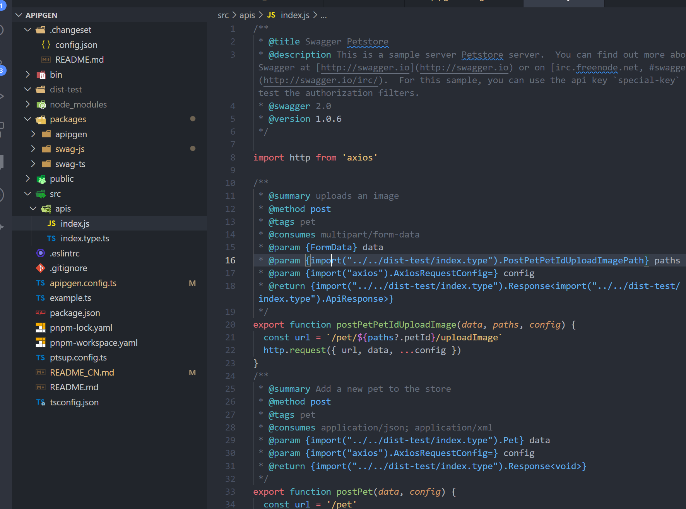

# API Pipeline Generator

> [中文](./README_CN.md) | English

API pipeline generator, which is used to convert OpenApi (v2~v3) and other input sources into TS/JS APIs, and currently supports axios templates

`Apipgen 'is developed by the pipeline concept and used as a general' api 'generation tool, which is not limited to' swagger/axios'.

```ts
const process = configs.map(
  pPipe(
    // external mode - config conver
    config => readConfig(config),
    // external mode - data source
    configRead => original(configRead),
    // external mode - to mode
    configRead => parser(configRead),
    // mode          - to internal mode
    configRead => compiler(configRead),
    // internal mode - to view
    configRead => generate(configRead),
    // view          - dest file
    configRead => dest(configRead),
  ),
)
await Promise.all(process)
```

## ⚙️ Install

Install it locally in your project folder:

```bash
pnpm add apipgen -D
# Or Yarn
yarn add apipgen --dev
```

You can also install it globally but it's not recommended.

## 📖 Usage

Currently, the CLI option is not provided, and the output content is determined by the config file. Currently, the following config files are supported:

- `apipgen.config.ts`
- `apipgen.config.js`
- `apipgen.config.cjs`
- `apipgen.config.json`

```ts
import { defineConfig } from 'apipgen'

export default defineConfig({
  /**
   * 使用的编译 pipeline 支持 npm 包（添加前缀apipgen-）或本地路径
   *
   * 默认支持 swag-ts|swag-js
   * @default 'swag-ts'
   */
  pipeline: 'swag-ts',
  // your input source and output file (swagger api url or json)
  // if you have multiple sources, you can use 'server'
  input: 'http://...api-docs',
  output: {
    main: 'src/api/index.ts',
    type: 'src/api/index.type.ts',
  },

  // your API baseUrl
  baseURL: 'import.meta.env.VITE_APP_BASE_API',
  // customize the output response type. default 'T'
  responseType: 'T extends { data?: infer V } ? V : void',
})
```

```sh
# run apipgen
pnpm apipgen
```


## Input

Input supports three input sources `url|json`

```ts
export default defineConfig({
  // directly pass in url
  input: 'http://...api-docs',
  // or
  input: { /* url|json */ }
})
```

## Server

Maybe you have multiple services. You can use 'server' to set multiple services. Usually, other config at the top level are used as additional config

```ts
export default defineConfig({
  // Your API baseUrl, this configuration will be passed to the axios request
  baseUrl: 'https://...',
  // all servers inherit the upper layer configuration
  server: [
    { import: '...', output: {/* ... */} },
    { import: '...', output: {/* ... */} },
    { import: '...', output: {/* ... */} },
  ]
})
```

## swag-js

Use the `swag-js` pipeline to generate JavaScript files with both types.

```ts
export default defineConfig({
  pipeline: 'swag-js',
  input: {
    uri: 'https://petstore.swagger.io/v2/swagger.json',
  },
})
```

Run `apipgen`



## Pipeline

When defining the configuration, apipgen passes in the 'pipeline' parameter to support the npm package (prefix `apipgen-`) and local path.

```ts
export default defineConfig({
  pipeline: './custom-pipe',
})
```

pipeline is defined by the `pipeline` method provided by `apipgen`.

```ts
// custom-pipe.ts

// create an API pipeline generator using the pipeline provided by apipgen
import { pipeline } from 'apipgen'

// each pipeline exposes corresponding methods, which can be reused and reorganized
import { dest, generate, original } from 'apipgen-swag-ts'

function myCustomPipe(config) {
  const process = pipeline(
    // read config, convert to internal config, and provide default values
    config => readConfig(config),
    // get data source
    configRead => original(configRead),
    // parse the data source as data graphs
    configRead => parser(configRead),
    // compile data and convert it into abstract syntax tree (AST)
    configRead => compiler(configRead),
    // generate code string
    configRead => generate(configRead),
    // use outputs to output files
    configRead => dest(configRead),
  )
  return process(config)
}

function readConfig(config) {
  // ...
}

function parser(configRead) {
  // ...
}

function compiler(configRead) {
  // ...
}
```
## Other

Sorry, I'm too lazy. You should know what else apipgen can do from this list.

- import (import related field aliases in the makefile - http or type)
- paramsPartial (force all parameters to be optional)
