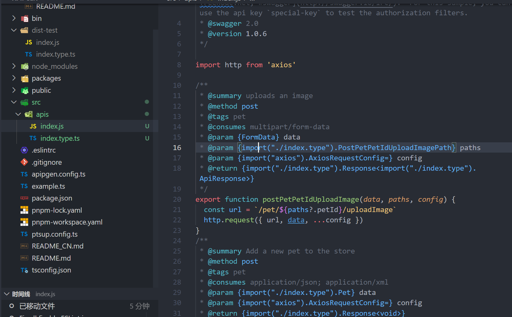

# API Pipeline Generator

> [English](./README.md) | 中文

API 生成器，用于将 OpenApi（v2~v3）和其他输入源转换为 TS/JS API，目前支持一下管道：

- `swag-axios-ts`
- `swag-axios-js`
- `swag-fetch-ts`
- `swag-fetch-js`
- `swag-ky-ts`
- `swag-ky-js`
- `swag-got-js`
- `swag-got-js`
- `swag-ofetch-js`
- `swag-ofetch-js`

## ⚙️ Install

在项目文件夹中本地安装：

```bash
pnpm add @genapi/cli @genapi/swag-axios-ts -D
# Or Yarn
yarn add @genapi/cli @genapi/swag-axios-ts --dev
```

> 您也可以全局安装，但不建议这样做。

## 📖 Usage

由 CLI | 配置文件确定输入/出内容。目前支持以下配置文件：

- `genapi.config.ts`
- `genapi.config.js`
- `genapi.config.cjs`
- `genapi.config.json`

```ts
import { defineConfig } from '@genapi/cli'

export default defineConfig({
  // 输入源(swagger url 或 swagger json)以及输出源
  // 如果有多个源，可以使用 server 字段
  input: 'http://...api-docs',
  output: {
    main: 'src/api/index.ts',
    type: 'src/api/index.type.ts',
  },

  // API baseUrl，此配置将传递给 axios
  baseURL: 'import.meta.env.VITE_APP_BASE_API',
  // 自定义 responseType，默认 T
  responseType: 'T extends { data?: infer V } ? V : void',
})
```

```sh
genapi --pipe swag-axios-ts
```


## Input


input 目前支持三个输入源 `url|json`

```ts
export default defineConfig({
  // 直接输入 swagger url
  input: 'http://...api-docs',
  // 或者选择其他源
  input: { /* url|json */ }
})
```

## Server

如果有多个服务。您可以使用 `server` 设置多个服务。顶层的其他配置被用作附加配置。

```ts
export default defineConfig({
  baseUrl: 'https://...',
  // 所有 server 都继承上层配置
  server: [
    { import: '...', output: {/* ... */} },
    { import: '...', output: {/* ... */} },
    { import: '...', output: {/* ... */} },
  ]
})
```

## swag-axios-js

使用 swag-axios-js 管道生成同时具备类型的 JavaScript 文件。

```ts
export default defineConfig({
  pipeline: 'swag-axios-js',
  input: {
    uri: 'https://petstore.swagger.io/v2/swagger.json',
  },
})
```

Run `genapi`



## Pipeline

genapi 由特殊的处理管道运作，从输入 config 到最终 dest 输出文件作为一个完整管道，而每个管道都可以相互复用并重组。

genapi 在定义配置时传入 `pipeline` 参数支持 npm 包（前缀 `@genapi/` 或 `genapi-`） 和本地路径。

```ts
export default defineConfig({
  pipeline: './custom-pipe',
})
```

管道中由 `genapi` 提供的 `pipeline` 方法定义。

```ts
// custom-pipe.ts

// 使用 genapi 提供的 pipeline 创建 API 管道生成器
import { pipeline } from '@genapi/core'

// 每个管道都暴露了对应方法，可以进行复用并重组
import { dest, generate, original } from '@genapi/swag-axios-ts'

function myCustomPipe(config) {
  const process = pipeline(
    // 读取配置，转换为内部配置，并提供默认值
    config => readConfig(config),
    // 获取数据源
    configRead => original(configRead),
    // 解析数据源为数据图表（graphs）
    configRead => parser(configRead),
    // 编译数据，转换为抽象语法树（AST）
    configRead => compiler(configRead),
    // 生成代码（code）
    configRead => generate(configRead),
    // 利用 outputs 输出文件
    configRead => dest(configRead),
  )
  return process(config)
}

function readConfig(config) {
  // ...
}

function parser(configRead) {
  // ...
}

function compiler(configRead) {
  // ...
}
```
## CLI

目前 genapi 支持以下脚本命令：

```sh
  --pipe <pipeline>  The compilation pipeline used supports npm package (prefix @genapi/ or genapi-) | local path
  --input <source>   The incoming string resolves to a uri or json path.
  --outfile <path>   genapi output file options
  -h, --help         Display this message
  -v, --version      Display version number
```
